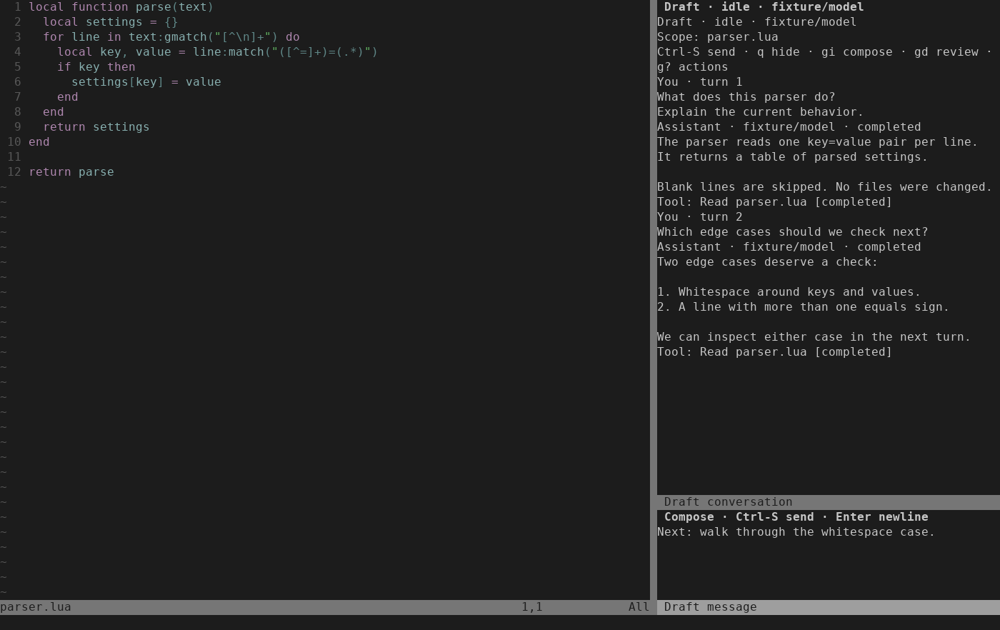
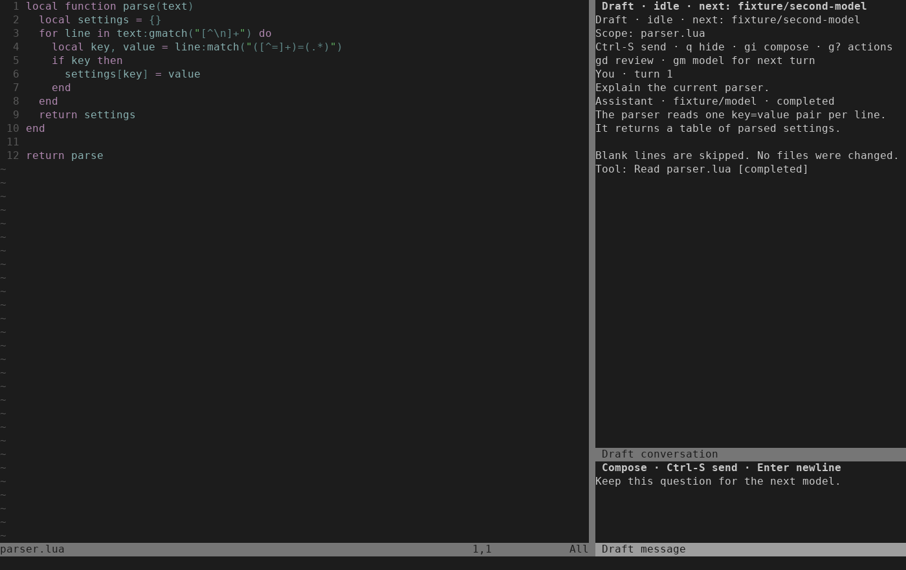
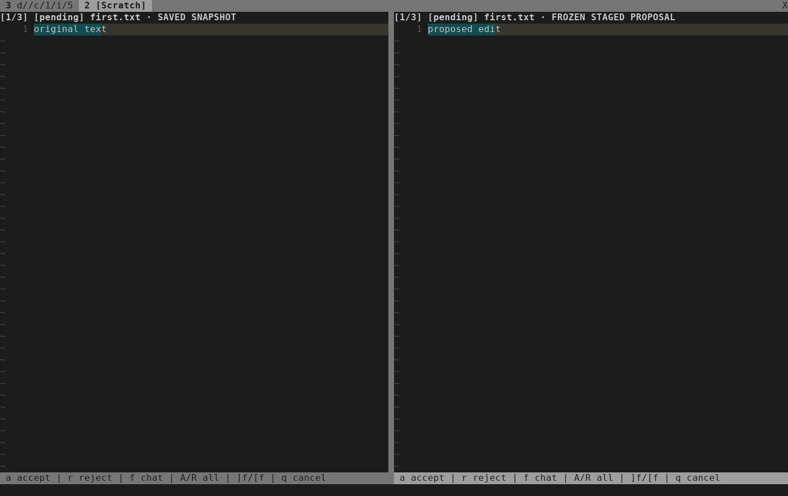
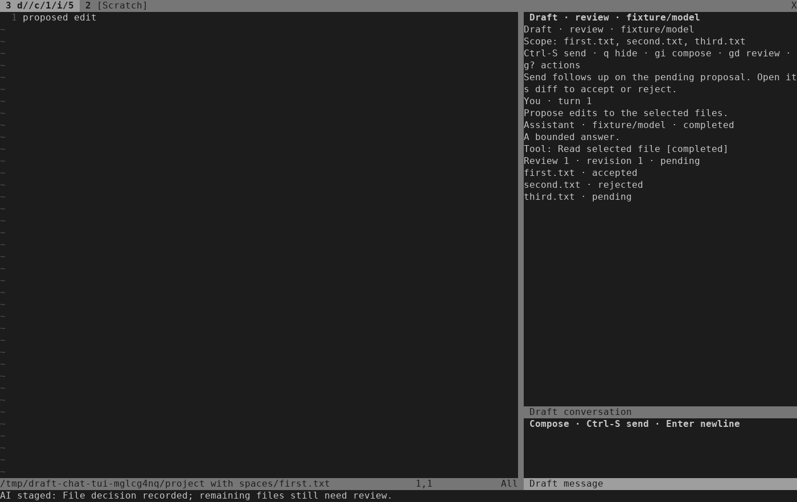

# Draft.nvim

An AI companion for Neovim, with explicit context and file review.

Draft has two editing workflows:

- **Native companions:** use Codex CLI, Claude Code, or OpenCode in a terminal,
  then review their changes **after they have been written**.
- **Staged OpenCode edits:** select saved files, let OpenCode edit isolated
  copies, and approve each frozen proposal **before it reaches your project**.

This is an early Linux extraction. `:NvimAIChat` offers multi-turn OpenCode
questions and edits beside your code, with streamed replies and explicit per-file
approval of frozen proposals. Configure the initial model with
`:NvimAIStageSetup`; use `:NvimAIChatModel` to choose a later turn's model.

Chat retains context across explicit turns with fresh isolated workers and the
same saved-source and frozen-review guards as staging. The
[approval validation record](docs/validation/2026-09-20-conversation-approval.md) covers
synthetic providers; the [controller record](docs/validation/2026-09-19-conversation-controller.md)
separately covers pinned OpenCode with a local scripted provider.
The [Linux live-provider record](docs/validation/2026-09-22-live-provider.md)
documents a four-turn OpenAI OAuth / GPT-6 Astra pilot with discussion, per-file
decisions, revision and conversation recall. It covers one disposable Linux
setup, not everyday use across accounts, models or backends.
The subsequent [normal-configuration acceptance](docs/validation/2026-09-26-normal-config.md)
covers installation and one reviewed README edit in a fresh editor using the
user's existing Neovim configuration. Both checks were agent-operated.

## Requirements

- Linux with working Bubblewrap (`bwrap`) and user/PID namespaces.
- Neovim **0.12+** with LuaJIT; tested with **0.12.4**. Neovim 0.11 is unsupported.
- Python 3 (standard library only), Git, and a POSIX shell. Tested with Python
  **3.14.4**, Git **2.53.0**, and Bubblewrap **0.11.1**.
- The CLI for your chosen backend, installed and authenticated separately.
  Managed OpenCode and staging require exactly **OpenCode 1.18.30 / ACP 1**;
  other OpenCode versions are refused.
- `rg` (ripgrep) for the staged file picker.
- Optional tmux. Health recommends **3.7+** for the full tmux integration;
  isolated transport fixtures also pass on **3.6**. Without tmux, the native
  companion uses a Neovim terminal split.

macOS and Windows launches are not supported. Linux fixture results do not
establish live-provider acceptance across all three backends.

## Install

With lazy.nvim:

```lua
{
  "ruohao1/draft.nvim",
  config = function()
    require("draft").setup()
  end,
}
```

Or add a checkout to your runtime path from your Neovim configuration:

```lua
vim.opt.runtimepath:prepend(vim.fn.expand("~/src/draft.nvim"))
require("draft").setup()
```

Then run `:checkhealth draft`. Loading and setup register commands without
installing a CLI, launching a companion, reading credentials, or sending a
prompt. Helpers load from the plugin's own `scripts/` directory; do not copy
them into your Neovim config directory.

Configure options on the first setup call; repeated setup calls return the
existing runtime. Restart Neovim after changing the plugin version or setup
options. The internal `ai` module names and `NvimAI*` commands are retained;
use one installation per Neovim process.

If migrating from an embedded `lua/ai` copy, move that copy out of your
Neovim configuration before loading Draft so its internal modules resolve from
the plugin.

## Ask questions in a conversation

1. Save the file you want to discuss. Run `:NvimAIStageSetup`, choose an explicit
   `provider/model` and optional existing auth-file path, then **Save and enable**.
2. Run `:NvimAIChat`, or `:NvimAIChat src/one.lua src/two.lua` for an explicit
   selection. Opening does not launch a provider, discover models or send work.
3. Press `i` in the composer and type a question. Enter adds a newline;
   **Ctrl-S** explicitly sends. Replies stream without moving your source cursor.
4. Ask another question with Ctrl-S. Press Escape then `q` to hide; run
   `:NvimAIChat` to reopen with the transcript and unsent draft intact.
5. Run `:NvimAIChatClose` to stop the conversation and release its scope.
   Closed history stays readable. Use `:NvimAIChatNew` for a fresh conversation.



| Command | Purpose |
| --- | --- |
| `:NvimAIChat [files...]` | Open or focus the current conversation |
| `:NvimAIChatNew [files...]` | Start after confirmed close; confirm discarding an unsent draft |
| `:NvimAIChatSend` | Submit the composer once, when the owner permits |
| `:NvimAIChatHide` | Hide without stopping or submitting |
| `:NvimAIChatCancel` | Cancel generation; confirm discarding a pending review |
| `:NvimAIChatRetry` | Retry only a failure proven safe to retry |
| `:NvimAIChatClose` | Close the owner; confirm discarding a pending review |
| `:NvimAIChatReview` | Choose a frozen proposal file for a read-only preview |
| `:NvimAIChatModel` | Choose an advertised model for the next turn while idle |
| `:NvimAIChatApprove` | Accept the visible pending file and advance after confirmation from the writer |
| `:NvimAIChatReject` | Reject the visible pending file, leaving it on screen |
| `:NvimAIChatApproveAll` | Confirm accepting all remaining files, after visiting every pending diff |
| `:NvimAIChatRejectAll` | Confirm rejecting all remaining pending files |

Inside either chat buffer, normal-mode `gi` focuses the composer, `gd` opens
review, `gm` chooses a model, `gc` cancels, `gr` retries, `gx` closes, and `g?` shows available actions.
Ctrl-S works in normal and insert modes; `q` hides only in normal mode.

After an explicitly sent turn negotiates model choices, press `gm` while idle
to choose from the latest advertised models for the configured provider. Before
that first negotiation, the picker explains that an explicit Send is required.
Selecting or cancelling never starts a worker, sends the draft or changes saved
settings. The `next:` label shows the selection; earlier replies keep their own
model labels. Generation, pending approval, failed sessions and closed history
refuse selection. Finish or explicitly discard pending review before switching.

The choice stays with this conversation, including hide/reopen, until changed.
An explicit New uses the saved default again. `:NvimAIStageSetup` separately
saves the default for future conversations. The next explicit Send resumes the
same session and revalidates the selected model before submitting. If options
change, authentication is missing, or model confirmation/resume fails, there is
no fallback model or replacement session. Follow the displayed recovery reason:
Retry is available only when proved safe; otherwise Close and explicitly start
a new conversation, which starts fresh context.



The [model-selection validation record](docs/validation/2026-09-20-conversation-model.md)
covers synthetic providers and real editor keys.

The [Linux acceptance checklist](docs/validation/2026-09-20-conversation-linux.md)
combines model changes, per-file approval and failure recovery in a disposable
worktree-Neovim session, with exact expected file contents.

When a turn proposes edits, open its frozen diff with `gd` or
`:NvimAIChatReview`. In the diff, `a` accepts the displayed file and advances to
the next pending file; `r` rejects it and stays on that file. Navigate with `]f`
and `[f`. `A` / `R` confirm accepting/rejecting all remaining files. Batch
approval requires visiting every pending diff in the current proposal revision.
The approval commands require visible frozen panels and do not open them for you.

Press `f` in a diff to return to the composer. **Send while review is pending is
a follow-up**: discuss the proposal or request a revision without accepting it.
A replacement requires fresh review; previously accepted/rejected files remain
confirmed context. Chat reports file outcomes from the writer's receipts, including
pending, accepted, rejected, cancelled, blocked and uncertain states.




Return to chat with `f` or `:NvimAIChat`. In a diff, `q` confirms discarding pending
files. ChatCancel and ChatClose also confirm this; earlier accepted files stay
saved. Closing only the diff tab makes no decision. If sources or frozen panels
change, approval refuses. Close the conversation, inspect/save your changes, and
start a new one. An uncertain outcome requires inspecting disk before further work.

The selection stays fixed for the conversation: 1–16 saved existing files,
at most 1 MiB combined, with the same file requirements as staging. New without
paths reuses the closed conversation's selection. Save dirty selected buffers
before sending. A refused send preserves your draft. Native and standalone staged
work remain excluded even while chat is hidden or idle, until close is confirmed.

The default right column becomes a bottom layout below 100 columns. Editors
smaller than 40 columns or 12 rows hide chat; resize and reopen explicitly.
The view keeps the newest 2 MiB / 20,000 lines and labels omitted earlier text.
The owner retains up to 64 turns / 32 MiB; composer submissions are limited to
32 KiB and oversized drafts are refused intact. Chat scratch buffers disable
swap files, persistent undo and modelines; no transcript archive is written.

## Start with pre-write approval

1. Open and save a small text file in your project.
2. Run `:NvimAIStageSetup`. Choose an explicit `provider/model` and, if needed,
   the path to an existing OpenCode auth file. Choose **Save and enable**.
   This saves preferences, without submitting a request or reading credentials.
3. Run `:NvimAIStage` and enter an instruction. Or use
   `:NvimAIStage Replace the greeting in this file`.
4. Inspect the **SAVED SNAPSHOT / FROZEN STAGED PROPOSAL** diff. Your project
   file is still unchanged by Draft at this point.
5. Press `a` to approve the current file, `r` to reject it, or `q` to cancel
   pending proposals. Approval rechecks the saved source and loaded buffers.

`:NvimAIStageFiles` opens a searchable file picker. You can also pass explicit
paths: `:NvimAIStageFiles src/one.lua src/two.lua`. Staging supports 1–16 existing
files, with a 1 MiB aggregate limit for both originals and proposed contents.
Files must be owned regular files with one link, mode `0644` or `0755`, UTF-8,
Unix line endings, no BOM/NUL, and a final newline (or empty contents). Each
file is limited to 20,000 lines; ACL-bearing files are refused.

In the review tab:

| Key | Action |
| --- | --- |
| `a` | Approve this file and advance to the next pending diff |
| `r` | Reject this file |
| `A` / `R` | Confirm approval/rejection of remaining files |
| `]f` / `[f` | Next/previous selected file |
| `f` | Request a revision of pending proposals |
| `q` | Cancel remaining proposals |

Batch approval requires visiting the changed diffs. Closing the review tab also
cancels pending proposals. Earlier accepted files stay written after a rejection,
cancellation, or follow-up. `:NvimAIStageFollowup [instruction]` revises only
pending proposals; predecessor approval tokens are retired.

Use `:NvimAIStageStatus` to inspect the current phase and exact artifact path,
`:NvimAIStageReview` to reopen review, and `:NvimAIStageCancel` to cancel work.
`:NvimAIStageReset` confirms forgetting preferences and disabling staging.

To route the normal prompt command through staging, run
`:NvimAIReviewMode pre_write`. It is a separate explicit choice; resetting
staging does not silently switch prompting back to native writes. Invalid
settings or unsupported backends refuse the prompt without a native fallback.

## Native companions and after-write review

`:NvimAIOpen` opens a read-only companion or focuses the existing one. Choose
an installed backend with `:NvimAIBackend [codex|claude|opencode]`.
OpenCode's first native use performs a local compatibility check; the picker
reports when validation is pending or unavailable.

`:NvimAINativePrompt` prepares explicit buffer/selection context and an
after-write review baseline, transfers the prompt into the native companion,
and focuses it **without submitting**. Inspect it and submit in the CLI.
`:NvimAIReview` opens detected changes; native edits have already reached disk.
Approval acknowledges those changes, while rejection uses the saved baseline
and source checks. It is not pre-write protection.

| Command | Purpose |
| --- | --- |
| `:NvimAIPrompt` | Prompt using the saved review mode; native is the initial default |
| `:NvimAIReviewMode [pre_write|native]` | Confirm and save the prompt review mode |
| `:NvimAIReview` | Review native changes after write |
| `:NvimAIReview!` | Confirm abandonment of native recovery data; does not revert files |
| `:NvimAIGrants [canonical-path]` | Inspect/revoke temporary outside-directory grants |
| `:NvimAIStatus` | Show status for the selected review mode |
| `:NvimAIClose` | Close the native companion and revoke temporary grants |

Native and staged activity exclude each other. Before staging, close the native
companion and resolve or explicitly abandon its review. One native runtime pins
one physical project/worktree; use a separate Neovim instance for another root.

## Configuration

Global mappings are disabled by default. Review-buffer controls remain available.
To enable the supplied mappings, set your leader first:

```lua
vim.g.mapleader = " "
require("draft").setup({
  keymaps = true,
  width = 40, -- native companion width
})
```

| Mapping | Command |
| --- | --- |
| `<leader>aa` | `NvimAIOpen` |
| `<leader>ap` | `NvimAIPrompt` (visual selection requires native mode) |
| `<leader>ab` | `NvimAIBackend` |
| `<leader>ar` | `NvimAIReview` |
| `<leader>ag` | `NvimAIGrants` |
| `<leader>as` | `NvimAIStatus` |
| `<leader>ax` | `NvimAIClose` |
| `<leader>ae` | `NvimAIStage` |
| `<leader>ac` | `NvimAIStageSetup` |
| `<leader>af` | `NvimAIStageFiles` |
| `<leader>at` | `NvimAIChat` |

Staging can also be configured for the current editor:

```lua
require("draft").setup({
  staged = {
    enabled = true,
    model = "your-provider/your-model",
    -- auth_file = "/absolute/path/to/opencode/auth.json",
  },
})
```

Explicit Lua staging settings are not persisted. The selected auth file must be
canonical, owned by you, and mode `0600`. Only the chosen provider's validated
credential is copied into a disposable staging profile when you submit work.
Staging does not inherit provider environment variables, project configuration,
other buffers, or unselected project files. Submitting authorizes sending the
selected file contents and your instruction to that provider.

`require("draft").compact()` returns compact native status for a custom
statusline. Draft requests a standard Neovim statusline redraw when it changes;
an optional `status = { redraw = function() ... end }` callback can integrate
with a statusline plugin. No particular UI plugin is required.

Tmux uses the owning window by default. `tmux_project_pairs = true` opts into
the legacy `@dotfiles_project_*` session-pair convention; it is not needed for
ordinary tmux use. See `:help draft-options` for details.

## State and limitations

Draft has fresh private namespaces and does not import previous companion state:

| Data | Location |
| --- | --- |
| Native runtime | `$XDG_RUNTIME_DIR/draft.nvim/`, or `/tmp/draft.nvim-<uid>/` |
| Native durable records | `$XDG_STATE_HOME/draft.nvim/`, or `~/.local/state/draft.nvim/` |
| Staging preferences | `stdpath("state")/draft.nvim/staged/settings.json` |
| OpenCode compatibility receipts | `stdpath("cache")/draft.nvim/opencode-compat/` |

Preferences store the model, opt-in flag, review mode, and optional auth-file
path, not credential contents. Proposal snapshots and receipts can retain file
contents in private `/tmp/nvim-ai-staged-*` directories. The legacy temporary
prefix is intentional; these are not reusable conversation sessions. Native
backend state can also contain sensitive session data. Protect these directories.

Staging uses filesystem isolation and a trusted approval writer; ACP permission
messages do not directly write to the project. Bubblewrap is not a network
firewall or protection against unrelated programs running as your user. Batch
publication is preflighted but **not atomic across files**. An unrelated writer
can race a final rename. A partial or uncertain outcome requires inspecting the
files and receipts; do not retry approval tokens or assume rollback occurred.

Crash recovery and retention management are incomplete. Inspect only the exact
artifact path reported by status when cleaning up obsolete evidence. Do not
delete whole temporary-directory families or reuse old proposal tokens.

A new editor starts fresh conversation context. SIGKILL can leave private
`/tmp/draft-conversation-config-*` launch configuration, and interrupted cache
writes can leave untrusted `.receipt-*` files in the compatibility cache. No
automatic retention limit is provided for these remnants. Confirm their users
have stopped before exact-path cleanup. Closing after a blocked or uncertain
publication preserves the recovery reason and file outcomes; it does not retry
writes, clear uncertainty or imply rollback.

See [testing and validation](tests/README.md) and `:help draft` for more detail.
Licensed under [MIT](LICENSE).
