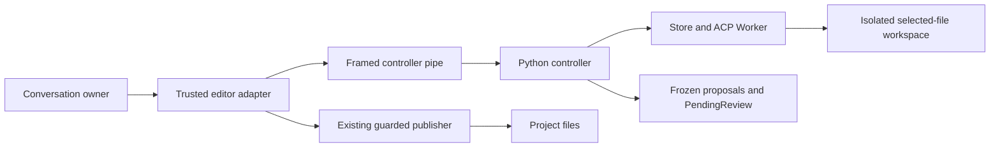

# Production conversation controller contract

Date: 2026-09-19. Status: accepted for implementation by the user's approval of
the linked contract and plan in [ISQ-232](https://linear.app/isqrd/issue/ISQ-232).
This records the implementation contract; runtime delivery is verified separately.

Implementation: [controller plan](../plans/2026-09-19-production-conversation-controller.md).
Tracking: [ISQ-233](https://linear.app/isqrd/issue/ISQ-233), within the
**Production conversation controller** milestone in Draft.

## Outcome and scope

Connect the existing Neovim conversation owner and framed editor pipe to the
existing Python ACP worker, retained store and staged review machinery. Two
explicit submissions must retain the actual backend session across fresh,
fully stopped workers. Answer-only turns return to idle. Changes become frozen
proposals before the existing guarded publisher can accept them.

This milestone delivers the internal production engine and its tested editor
integration. Composer/transcript layout and navigation belong to ISQ-234;
user-facing per-file approval integration to ISQ-235; model-picker UX to ISQ-236;
hands-on feature acceptance to ISQ-237; Rust migration to ISQ-252. Internal source,
review and receipt adapters required to keep the engine safe belong here.

No new public chat command or automatic routing of existing commands is enabled
by this plan. The internal factory is exercised through real headless Neovim.

## Existing foundation

The standalone repository contains the lifecycle/review/follow-up state owner,
the real editor-side pipe, Store, Worker and PendingReview. Their tests establish
their individual boundaries. The editor pipe currently talks to a scripted
controller, so those results do not establish integrated production behavior.

The CI prerequisite is complete: main commit `c6d4d198fe019c9372ab0a2bae24dc3afca462c1`
[passed 46/46 suites](https://github.com/ruohao1/draft.nvim/actions/runs/35465631395).
Earlier pinned-runtime continuity probes exist in the extracted tests; fresh
production-controller interoperability remains a delivery gate.

## Chosen architecture

| Approach | Consequence | Decision |
| --- | --- | --- |
| Retain a private backend store and reap each worker before review | Reuses the existing stop-before-freeze and publisher boundaries; requires verified resume | Recommended |
| Keep a writable worker alive during review | Requires a different proof that proposals cannot change | Outside this milestone |
| Start unrelated sessions and replay transcript text | Does not prove the promised backend continuity | Does not satisfy acceptance |

The Lua owner remains the presentation-facing action/state API. Python owns real
session, process, storage and proposal facts. The editor adapter owns source-buffer
and viewed-diff checks. It composes these facts into existing semantic events;
neither agent text nor transport success grants publication authority.

For a frozen result, the controller may attach a private `review_ref` containing
its registered manifest path and token. The adapter validates and consumes this
reference through the shared review reader, removes it before passing the event
to the semantic owner, and never accepts an equivalent reference from an action
or ACP message. The owner continues to see only bounded proposal identities and
file states. This supplies actual frozen material without copying arbitrarily
escaped file contents into the editor event frame.

Keep these identities separate: conversation ID, owner generation, explicit turn
ID, worker generation, backend session ID, review round, proposal revision/token,
proposal-local receipt ordinal and UI view revision. Every command/event is bound
to the owning conversation. Independent command serials fence cancellation and
close even when they refer to the same turn.

## Global constraints

- Linux, Neovim 0.12+, Python 3 standard library, OpenCode 1.18.30 / ACP 1.
- One owning editor/controller lifetime, one canonical project root, one configured provider, and 1–16 explicitly selected saved existing files.
- Selected source bytes and resulting proposal bytes each have a 1 MiB aggregate limit; retain existing UTF-8, mode, ACL, link and identity checks.
- Only the existing guarded staged publisher writes project files. Generation has no writable project mount.
- No automatic prompt replay, new-session fallback, native fallback, implicit login, cross-editor adoption or crash resume.
- No paid requests, real account credentials, installations or live editor/tmux/configuration changes are needed for automated validation.
- Keep native and standalone staged behavior compatible. Internal module names remain `ai` and helper names remain `nvim-ai-*.py`.
- Store ownership, private permissions and artifact validation remain mandatory; restricted test environments are not a reason to weaken them.

## Lifetime and transitions

| Phase | Permitted work and exit evidence |
| --- | --- |
| idle | No worker or pending proposal. A new explicit submission starts work. |
| starting | Capture selected sources, initialize, create/resume, confirm configuration. Cancel/close remain serviceable. |
| generating | One prompt; bounded text/progress events. Cancel/close remain serviceable. |
| stopping | Close/reap the full owned worker boundary, validate retained state, then inspect output. |
| review | No worker. Frozen proposal identity controls decide/revise/cancel/close. |
| publishing | One existing guarded local write; retain its result before accepting another action. |
| cancelling | Stop active work and retire pending authority. Previously accepted files remain published. |
| failed | Preserve truthful submission and recovery evidence; explicit retry only when positively safe. |
| closing/closed | Retire owned proposals and clean proven-owned state after exit. Cleanup failure remains visible. |

Normal completion needs a valid `end_turn` result, settled graceful Worker exit,
Store validation and valid selected output. Question-only output creates no token.
Review is possible only after these facts hold. A forced or unknown stop cannot
authorize freezing, publication or continuation.

Cancellation during an active prompt needs the matching `cancelled` stop reason,
graceful exit and validated Store before returning to an eligible idle state.
During startup, do not invent an ACP prompt-cancellation acknowledgement when no
prompt exists. Startup cancellation may fail with recovery required; a safe
pre-submission failure may permit an explicit retry only with positive exit and
retained-state evidence. Cancelling a worker-free review needs genuine retirement
receipts, with no fabricated ACP operation.

Editor stdin EOF initiates supervision from startup, generation, idle and review.
Broken editor output is also owner loss. Stop/reap before deleting mounted state.
Controller death relies on the existing Bubblewrap parent/PID boundary; a new
controller never adopts the interrupted store. If cleanup cannot be proved,
retain exact owned evidence and report recovery rather than claiming success.

## ACP behavior

Require the pinned version and protocol at every worker handshake. First turn:
`session/new` at `/tmp/project` with no MCP servers. Subsequent turns:
capability-gated `session/resume` with the same opaque ID. This milestone implements
the pinned resume path; optional `session/load` support is deferred. A failed
resume never triggers a different restoration method automatically.

Read advertised select options, validate the authorized provider/model and mode,
apply them through `session/set_config_option`, and verify returned current values
before transmitting the user prompt. No model discovery process runs on passive
construction or selection. The engine revalidates a configured model; picker UX
is a sibling deliverable. The
[pinned implementation](https://github.com/anomalyco/opencode/blob/3104c1428ec91f809e5ab86631300de41eb6952e/packages/opencode/src/acp/service.ts)
contains new/resume/configuration handlers; their presence is not runtime proof.
The [configuration contract](https://agentclientprotocol.com/protocol/v1/session-config-options)
defines the returned configuration state.

Advertise filesystem/terminal client capabilities false and deny unexpected
client operations. Allow only validated edit permission requests for currently
editable sandbox paths with an advertised `allow_once` option. Retain OS
confinement even if an agent issues a denied client callback. Shell, skills, task,
web, formatter, LSP, sharing, automatic compaction and pruning stay disabled.

Accept bounded text and tool-status data for the current session; project neither
tool arguments nor raw errors into status. Unknown additive ACP fields may be
ignored only where the pinned schema permits them; wrong types, duplicate keys,
invalid identities or contradictory required fields fail closed. The trusted
editor protocol uses closed schemas. Match terminal prompt responses exactly.
ACP cancellation is a notification followed by a response to the original prompt,
as defined in the [prompt-turn contract](https://agentclientprotocol.com/protocol/v1/prompt-turn).

## Editor, review and publication boundary

Construction is passive. A trusted factory resolves the module-relative Python
helper and validated executable/profile options. User actions and agent output
cannot supply argv, auth paths, manifests or publisher commands. The factory
obtains a runtime lease so idle/hidden conversations still exclude native and
standalone staged activity, including previously queued pickers.

Before start/revise, capture saved selected buffers and aliases using the existing
staged rules; send ordered path/hash records to Python. Python independently
validates disk snapshots. Before exposing review or restoring a predecessor,
the editor adapter rechecks its captured buffers. Drift fences review actions and
requires retirement/close; it never gets converted to `context_valid=true`.

Extract the existing frozen-review guards as an internal shared handle, retaining
its source aliases, frozen panels, token and per-revision visited state. Successful
approval remains the existing synchronous, at-most-five-second local writer
operation so editor keystrokes cannot race between its buffer check and publish.
Do not move the project write into an asynchronous controller callback.

After that operation, the controller validates the actual decision journal through
a public receipt-reading method owned by `nvim-ai-staged-decisions.py`. It accepts
the expected intent and identity, not caller-supplied success booleans or receipts.
Receipt uncertainty fences remaining decisions and preserves earlier confirmed
outcomes. The existing publisher stays the only implementation of project writes.

A follow-up holds PendingReview while working on pending copies only. After full
worker exit, revalidate disk/buffer context and candidate bytes; call
`PendingReview.retire()` before installing a replacement. A discussion-only answer
keeps a positively revalidated predecessor active. Restore after failure only with
positive predecessor and unused-candidate retirement evidence. Each replacement
uses a fresh token, resets its receipt ordinal and requires fresh diff visits.

Keep confirmed accepted/rejected/cancelled outcomes in a bounded editor-context
block for the next explicit message. Rejected proposed bytes are never described
as committed. Later independent turns recapture the fixed selection from saved
sources. No context update itself sends a provider request.

## Limits and supervision

| Boundary | Limit |
| --- | --- |
| Startup | 15 seconds per RPC, 60 seconds total |
| Generation | 180 seconds, never renewed by output |
| Worker shutdown | 3 seconds each for EOF, TERM, KILL/reap |
| Prompt cancellation response | 5 seconds, followed by bounded worker shutdown |
| Existing local publisher | 5 seconds; timeout is an uncertain outcome |
| Editor adapter | Explicit 270-second command watchdog, 10-second per-stage stop watchdog; controller deadlines remain tighter |
| Editor command | 1 MiB/frame, 2 MiB queued bytes, depth 32, 8,192 lexical tokens, at most 64 queued commands |
| Editor events | 8 MiB/frame, 32 MiB and 20,000 frames/command, 32 MiB outstanding raw input |
| Controller output delivery | 32 MiB queued; each oldest frame has an absolute 5-second delivery deadline |
| ACP wire | 16 MiB/frame, 32 MiB and 20,000 messages/worker |
| Display | 64 turns, 32 MiB transcript, at most 1 MiB per text fragment |
| Progress | 256-byte tool ID/title; enumerated status; charged against event/display budgets |
| Retained backend artifacts | `opencode.db`, `opencode.db-wal`, `opencode.db-shm`; owned single-link regular files, mode 0600, 64 MiB combined |

A nonblocking controller services editor input between ACP polling slices of at
most 50 ms and bounded batches. Add a trusted write-wait interrupt hook to Worker
for cancellation/EOF while an ACP request or callback reply is blocked. Never
interleave a cancel frame into a partially written JSON frame: interrupt, stop,
and report the submission/state as uncertain when necessary. Cancellation under
backpressure need not be eligible for resume.

Controller output uses a bounded queue; an editor that stops reading cannot leave
generation running indefinitely. Queue exhaustion or delivery timeout triggers
owner-loss shutdown. Worker stop remains independently bounded when command or
display budgets are exhausted. These are operational bounds, not a hard realtime
or disk-quota guarantee.

Retain private backend state only for the owner lifetime. The controller checks
metadata, never queries or repairs the database on the host. Use fresh filtered
credentials/profile per worker. No raw stderr, credentials, database bytes or
transcript bodies go to health output, CI logs or Linear. Closed transcript
retention across several UI views remains part of ISQ-234's aggregate budget.

## Acceptance and review decisions

ISQ-232 review must accept the existing store/restart choice plus the concrete
integration decisions here: resume-only support, truthful startup cancellation,
write-wait interruption, aligned watchdogs, shared synchronous publication guards,
and receipt verification owned by the decision module. The user's subsequent
approval accepts those decisions; it does not establish runtime completion.

ISQ-233 completes when real editor → production controller → isolated worker
tests cover two turns, answer-only completion, cancellation, EOF, hostile input,
immutable proposals, receipts and revision retirement. Independently run the
pinned OpenCode binary with a loopback scripted provider to prove backend history
continuity and configuration restoration. Fixture success alone is insufficient.
Full default CI must pass on the reviewed branch and after merging to main.
