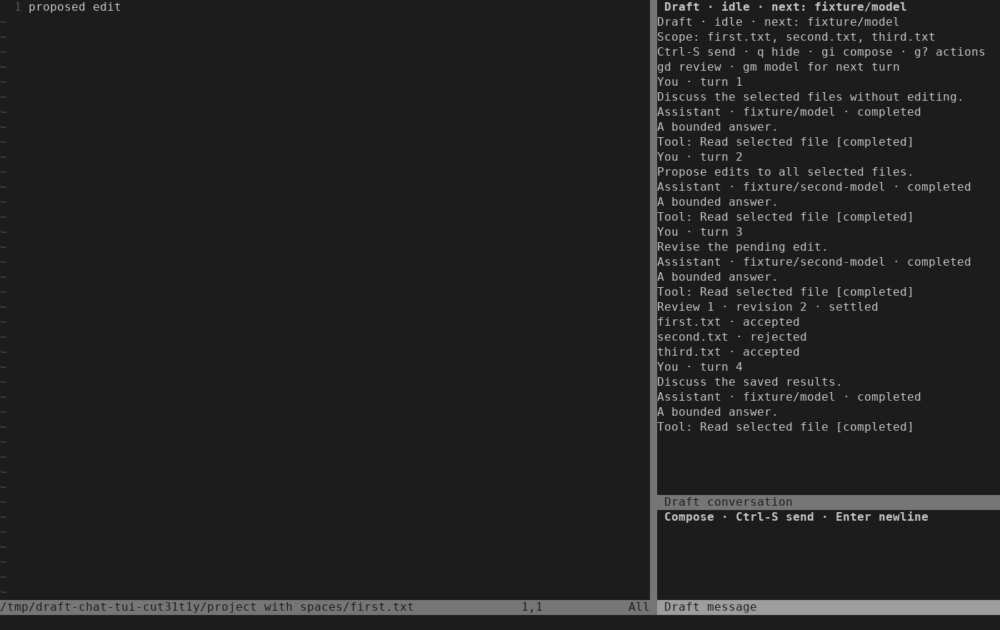

# Linux conversational acceptance — 2026-09-20

This record covers [ISQ-237](https://linear.app/isqrd/issue/ISQ-237) and the
integrated **Usable conversational editing** milestone. It uses the real Neovim
runtime, production controller, Bubblewrap workers, frozen review and guarded
writer with a scripted ACP peer. The [acceptance plan](../superpowers/plans/2026-09-20-conversation-linux-acceptance.md)
maps the existing tests and the added boundaries.

A subsequent [live-provider pilot](2026-09-22-live-provider.md) passed on
2026-09-22. This record retains the scope and results of the earlier fixture run.

Baseline: `f4ec449d2c11532c7ad2a185d26d70b17e4a6cd7`;
implementation checkpoint: `b2c765b`. Final candidate and CI evidence are recorded
on the issue and delivery PR. The baseline's 58/58 CI is distinct from this run.

## Evidence and environment

| Evidence class | Result |
| --- | --- |
| Automated provider-free fixtures | Focused gates and the complete default gate passed: 58/58 suites, 0 failures |
| Automated real terminal input | Four `nvim_ai_chat_ui` cases passed, including production approval followed by model selection |
| Agent-operated fixture checklist | Four disposable Neovim/tmux walkthroughs passed: combined journey, disk conflict, unsaved buffer and full rejection; exact bytes below were checked on disk |
| User-performed manual acceptance | Not run; the exact repeatable checklist follows |
| Installed OpenCode with a scripted provider | Not rerun in this acceptance; separate historical evidence is in the [controller record](2026-09-19-conversation-controller.md) |
| Live-account/provider acceptance | Not run; no credential, account or paid model operation was authorized or performed |

Observed local versions: Linux `7.0.0-30-generic` x86_64, Neovim `0.12.4`,
LuaJIT `2.1.1774638290`, Python `3.14.4` (including `/usr/bin/python3`), Bubblewrap
`0.11.1`, tmux `3.6`, Git `2.53.0`, ripgrep `15.2.0`. Confined fixtures ran in an
authorized host execution context; ownership, socket and namespace checks were
not weakened. No packages were installed. CI uses its own recorded Linux image
and versions; these local versions are not a claim of cross-platform support.

Focused evidence:

- `run-2q76u0jy`: production approval/model journey, four TUI cases and relocated
  installation, 3/3 suites.
- `run-f9gitf13`: 32 controller tests, including a real SIGKILL of hidden Neovim.
  The unchanged lifetime/store/driver suites passed in `run-a4gh1xta`.
- `run-rniawfj6`: 20 cache tests, with two expected installed-provider skips.
- `run-gln7at9d` → `run-z3x5bk4p`: two terminal-receipt regressions and the public
  blocked-publication Close path failed before the fix, then all three affected
  suites passed; the registry suite includes 11 tests.
- The agent-operated walkthrough recorded each source file after every decision.
  A final capture waited for the completed fourth turn and idle render.

Run the complete default gate from this checkout:

```sh
stylua --check lua tests
git diff --check
python3 -I -B tests/run.py
```

The complete gate passed at implementation checkpoint `b2c765b` with this
acceptance documentation present: **58/58 suites, 0 failures**. Per-suite logs
are in `.test-results/run-0qoqqydb`; the summary is
`.superpowers/sdd/2026-09-20-conversation-linux-acceptance/release-tests.log`.
Delivery archives preserve these local paths, the focused failure/success logs
and the terminal observations. Final commit and CI links are on ISQ-237 and its PR.
Installed-provider opt-ins remained skipped, including OpenCode artifact audit,
ACP resume/interop and installed-agent cache/lifetime/staged cases. These skips
are expected in the provider-free gate and do not count as live-provider evidence.

## Acceptance coverage

| Boundary | Evidence |
| --- | --- |
| Discussion → model selection → proposal → partial decisions → revision → another model → discussion | `ai_chat_approval`: five explicit prompts, one session/new and four session/resume calls; immutable old model labels, exact decision context and real source bytes |
| Actual keys and relocatable installation | `nvim_ai_chat_ui`, `nvim_ai_install`; four additional agent-operated checklist runs use the same production fixture |
| Passive opening, hide/reopen, saved-default boundaries and stale model dialogs | `ai_chat`, `ai_chat_controller`, `ai_chat_model`; no worker or prompt merely to select a model |
| Changed capabilities, missing synthetic auth, failed confirmation/resume | `nvim_ai_conversation_controller`; no hidden fallback, second prompt or replacement session |
| Cancellation, retry and late events | `ai_conversation`, `ai_conversation_driver`, controller cancellation cases; explicit safe retry only, stale completions fenced |
| Partial decisions, retired approvals, source/alias/frozen-buffer changes | `ai_chat_approval`, `ai_conversation_review`, staged decision/publish/multi/refine suites; accepted files remain published and other changes refuse |
| Closing after a terminal writer failure | Real registry journals and public commands prove backend close preserves accepted/blocked/uncertain outcomes and recovery evidence; missing consumption evidence refuses |
| Process shutdown, retained store identity and restart | Controller EOF/SIGKILL/death cases, conversation lifetime/store suites; fresh owners never adopt dead-owner state |
| Native/pre-write exclusion | `ai_runtime`, `ai_scope`, `nvim-ai-native`, public chat tests and the hidden-chat checklist step |
| Interrupted cache writes | A disposable helper is killed after an observed write marker; the complete orphan stays private and produces a miss for its valid key; later audit/warm reuse succeeds |

The Close regression was found by the disk-conflict walkthrough. A terminal
writer failure already consumes the remaining approval authority. The registry
previously kept that review current and attempted a second cancel on Close,
which the writer correctly refused. It now clears current authority once a
validated receipt has no pending files. Receipt parsing and consumption-marker
checks remain mandatory; close retains recovery information and never retries a
write, rewrites a journal, clears uncertainty or claims rollback.

## Reproduce in worktree Neovim

Use Linux with the dependencies above and a terminal at least 140 columns × 42
rows for the reference layout. Start in the checkout being evaluated. Trusted
helper files must not be group/world writable; see [test setup](../../tests/README.md).
The following command creates disposable HOME/XDG directories and selects the
scripted peer explicitly. It does not load personal Neovim configuration.

```sh
DRAFT_ACCEPTANCE_PLUGIN="$(pwd -P)"
DRAFT_ACCEPTANCE_NVIM="$(command -v nvim)"
DRAFT_ACCEPTANCE_ROOT="$(mktemp -d /tmp/draft-chat-acceptance.XXXXXX)"
chmod 700 "$DRAFT_ACCEPTANCE_ROOT"
for part in home config data state cache run; do
  mkdir -m 700 "$DRAFT_ACCEPTANCE_ROOT/$part"
done
printf 'Fixture root: %s\nPlugin checkout: %s\n' "$DRAFT_ACCEPTANCE_ROOT" "$DRAFT_ACCEPTANCE_PLUGIN"
env -i \
  PATH="$(dirname "$DRAFT_ACCEPTANCE_NVIM"):/usr/bin:/bin" \
  LANG=C.UTF-8 TERM=xterm-256color NVIM_LOG_FILE=/dev/null \
  HOME="$DRAFT_ACCEPTANCE_ROOT/home" \
  XDG_CONFIG_HOME="$DRAFT_ACCEPTANCE_ROOT/config" \
  XDG_DATA_HOME="$DRAFT_ACCEPTANCE_ROOT/data" \
  XDG_STATE_HOME="$DRAFT_ACCEPTANCE_ROOT/state" \
  XDG_CACHE_HOME="$DRAFT_ACCEPTANCE_ROOT/cache" \
  XDG_RUNTIME_DIR="$DRAFT_ACCEPTANCE_ROOT/run" \
  DRAFT_TEST_ROOT="$DRAFT_ACCEPTANCE_PLUGIN" \
  DRAFT_CHAT_UI_ROOT="$DRAFT_ACCEPTANCE_ROOT" \
  DRAFT_CHAT_UI_SCRIPT="$DRAFT_ACCEPTANCE_PLUGIN/tests/fixtures/ai/chat_approval_ui.lua" \
  "$DRAFT_ACCEPTANCE_NVIM" --clean -u NONE -i NONE \
  --cmd 'lua vim.opt.rtp:prepend(vim.env.DRAFT_TEST_ROOT)' \
  -c 'lua dofile(vim.env.DRAFT_CHAT_UI_SCRIPT)'
```

Confirm the loaded plugin with
`:lua print(vim.api.nvim_get_runtime_file("lua/draft/init.lua", false)[1])`.
It must be inside this checkout. `:lua print(chat_approval_fixture.root)` shows
the disposable root. The selected files are `first.txt`, `second.txt` and
`third.txt` under its `project with spaces` directory.

Use the prompts literally: `Discuss` is a case-sensitive control word in this
fixture. Press `i` to type in the composer, Ctrl-S to send, then Escape for normal
mode. Enter alone inserts a newline. Wait for each expected state; state changes
and transcript rendering can finish at different instants.

Every disk value below is one line with a trailing newline. The four walkthroughs
were exercised by the agent through real terminal input; the checkboxes below
are for a separate user's run.

| Check | Action and expected result | Disk: first / second / third |
| --- | --- | --- |
| ☐ | Open fixture and try `:NvimAIChatModel`. Expect `Model choices are available after an explicitly sent, successfully negotiated turn`; opening remains passive. | original text / original text / original text |
| ☐ | Send `Discuss the selected files without editing.`. Wait for idle and `Assistant · fixture/model`. | original text / original text / original text |
| ☐ | Type `Propose edits to all selected files.`, Escape, `gm`, select the second model. Expect `next: fixture/second-model` and the intact unsent draft. | original text / original text / original text |
| ☐ | `q` hides; `:NvimAIChat` reopens the same draft. Ctrl-S explicitly sends. Wait for review. | original text / original text / original text |
| ☐ | Try `:NvimAIChatModel` during review. Expect `Model selection requires an idle conversation; current state: review`. | original text / original text / original text |
| ☐ | `gd`, select first file. Inspect SAVED SNAPSHOT / FROZEN STAGED PROPOSAL. | original text / original text / original text |
| ☐ | `a` accepts first and advances. `r` rejects second and stays there. | proposed edit / original text / original text |
| ☐ | `f` returns to chat. Send `Revise the pending edit.`; earlier decisions remain confirmed. | proposed edit / original text / original text |
| ☐ | `gd`, choose third, inspect `revised edit`, then `a`. Wait for idle. | proposed edit / original text / revised edit |
| ☐ | `:NvimAIChat`, `gm`, choose first model. Send `Discuss the saved results.`. Earlier labels stay fixed; accepted/rejected/accepted receipts remain. | proposed edit / original text / revised edit |
| ☐ | Hide chat, then `:NvimAIStage`. Expect an ownership refusal and no new prompt/worker. | proposed edit / original text / revised edit |
| ☐ | `:NvimAIChatClose`, wait for closed, then `:NvimAIChatNew`. Expect empty history, default fixture/model and no automatic send. | proposed edit / original text / revised edit |



Run the launcher again for each additional check:

1. **Disk conflict:** send `Propose edits to all selected files.`, then `gd` and
   select first. Run
   `:lua vim.fn.writefile({"external change"}, chat_approval_fixture.files[1])`,
   then `:NvimAIChatApprove`. All files become blocked; chat reports
   `Writer outcome requires recovery; confirmed file decisions are retained`.
   First-file bytes remain `external change\n`; the other two remain original.
   Close succeeds while retaining the recovery reason and file outcomes.
2. **Unsaved buffer:** make the same proposal and open first. Run
   `:lua local b = vim.fn.bufadd(chat_approval_fixture.files[1]); vim.fn.bufload(b); vim.api.nvim_buf_set_lines(b, 0, -1, false, {"unsaved change"})`,
   then `:NvimAIChatApprove`. Expect
   `Source buffer changed; save and start a fresh turn. Previously accepted files remain published`.
   No disk file changes. Check the modified flag and text with
   `:lua local b = vim.fn.bufadd(chat_approval_fixture.files[1]); print(vim.bo[b].modified, vim.api.nvim_buf_get_lines(b, 0, -1, false)[1])`:
   it reports `true` and `unsaved change`. Close requires confirmation to discard
   the still-pending review; the buffer edit remains intact.
3. **Complete rejection:** make the same proposal and open first. Press `R` and
   confirm `Reject remaining 3 file(s)?`. Wait for idle; all originals remain.

End each run with `:NvimAIChatClose`, confirm pending-review discard when asked,
and wait for closed. Then run
`:lua assert(chat_approval_fixture.snapshot().phase == "closed"); chat_approval_fixture.cleanup()`
and `:qa!`. Record the result and exact artifact paths before deleting that
run's disposable directory. Never delete directory families. A failed cleanup
must stay reported as failed; retain its evidence until process shutdown is proven.

## Restart, cleanup and retention

| Event or artifact | Established behavior |
| --- | --- |
| Normal editor exit / confirmed Close | Controller and worker stop; owned backend store and launch configuration are removed. Frozen proposal/receipt evidence has its separate retention policy. |
| Neovim SIGKILL while hidden and generating | Controller sees pipe EOF and removes its worker/store. The killed editor cannot run its Lua exit callback, so its private launch configuration can remain. |
| Controller killed during active work | The confined worker boundary dies; private evidence can remain. A fresh owner does not adopt it. |
| New editor or explicit New | Fresh conversation context; no transcript restoration, automatic prompt replay, old store adoption or approval-token revival. Saved accepted writes remain on disk. |
| Blocked/partial/uncertain publication | Close releases the backend while preserving receipt-derived outcomes, cleanup candidates and the recovery flag. Inspect actual files and receipts; no rollback or safe retry is inferred. |
| Interrupted compatibility receipt | A `.receipt-*` file may remain private and untrusted. Only a validated complete `compatibility.json` is used. A later audit and warm cache reuse still work. |

Launch artifacts use `/tmp/draft-conversation-config-*` with a `0700` directory
and `0600` `launch.json`. They may contain provider configuration and an auth-file
path; treat them as sensitive. Each compatibility receipt is bounded at 65,536
bytes and mode `0600`, but repeated interrupted writes have no aggregate retention
limit. Automatic cleanup for these remnants is not implemented. Inspect/remove
only an exact, identified artifact after proving no owned process can use it.

## Release/install decision

This evidence and the passing 58-suite default gate support the Linux
scripted-provider workflow. A separate authorized live-provider pilot
is the next acceptance decision. Fixture passes do not establish live-account,
macOS, Windows or Codex/Claude conversational compatibility.

Known limitations remain automatic crash recovery, transcript restoration,
orphan retention management and non-atomic multi-file publication. These must
remain visible in any release decision. No installation, package change, provider
request, account action or release is performed by this acceptance work.
