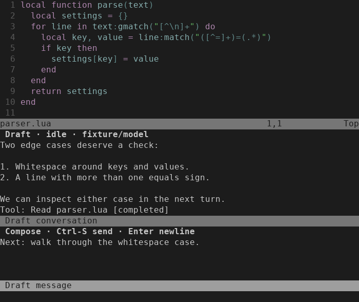

# Conversation UI validation — 2026-09-20

Scope: [ISQ-234](https://linear.app/isqrd/issue/ISQ-234), the first checkpoint of
**Usable conversational editing**. The public UI now provides explicit multi-turn
questions, retained drafts/history, cooperative lifecycle controls and read-only
frozen proposal navigation. Chat approval/revision controls (ISQ-235), model
selection (ISQ-236) and integrated/live-account acceptance (ISQ-237) remain separate.

## Observed behavior

| Boundary | Evidence |
| --- | --- |
| Passive setup and opening | `draft_setup`, `ai_staged_shared`, `ai_chat_controller`: no provider/helper startup during setup, no ACP worker or request on open; copied effective launch settings |
| Explicit two-turn conversation | `ai_chat_controller`: two public Send commands produce exactly two ACP prompts; one new session and one eligible resume; disk unchanged |
| Streaming and input | Text and progress visible while the real fake-ACP process is held before settlement; source focus and unsent composer survive; real terminal Enter adds a newline and Ctrl-S sends |
| Hide, cancel and close | Hidden owners retain runtime exclusion; hidden cancellation reaches ACP; confirmed close removes controller/private launch state; closed history remains until explicit New |
| Scope and callback guards | Dirty selected buffers refuse before another ACP prompt; drafts remain; stale menus and review/cancel/close/New choices cannot act after edits, owner revision or hide/reopen/disposal |
| Review navigation | Production edit proposals create no diff tab until explicit Review; preview changes no project bytes; unopened cancellation works; dirty aliases and changed/deleted frozen panels refuse display/publication |
| Bounded presentation | Newest 2 MiB / 20,000 lines with omission marker and UTF-8 boundaries; 32 KiB composer limit refuses intact; historical viewport, source focus, window ownership and buffer reuse covered |
| Installation and exit | Public flow repeated from a relocated checkout with spaces/unrelated cwd; real Neovim exit stops controller/worker and removes task/store/private launch paths, observed with process handles |

Focused runs passed: view/configuration **3/3**, commands/lifecycle **6/6**,
deferred and legacy staged reviews **6/6**, public flow/relocation/EOF **3/3**
(including **28** controller tests), and actual TUI **1/1**.

## Actual terminal captures

These show the real Neovim 0.12.4 TUI in a private tmux server. Content is synthetic;
the screenshot fixture drives the real public UI and semantic owner with an
in-process provider. The PNG renderer translates the captured terminal cells and
colors without reconstructing the layout. Both images were visually inspected.

At 140×42, source and conversation share the editor:

At 70×28, the transcript and retained composer move below the source:

The real-key test also checks 30×9 hiding, explicit reopening after enlargement,
two Ctrl-S submissions, no submission on Enter, q hide and read-only closed history.
Reproduction commands are in [tests/README.md](../../tests/README.md).

## Validation boundaries

This change uses disposable homes, synthetic providers, loopback audit endpoints
and private editor/tmux processes. It does not exercise a paid request, personal
credentials or the user's live editor/configuration. Existing controller
[pinned OpenCode evidence](2026-09-19-conversation-controller.md) is separate.

The complete default suite passed **56/56**, with the expected installed-provider
opt-in skips. `stylua --check lua tests` and `git diff --check` passed. Independent
review, exact-head CI and post-merge CI are delivery gates tracked in ISQ-234 and
its linked PR. The milestone remains open for the three sibling issues.

## Independent review and retention fix

The fresh whole-branch review of `1772149..fabf180` found one Important issue and
no Critical or Minor findings: disabling persistent undo files had left in-memory
transcript undo enabled. Replacing the bounded projection repeatedly retained its
earlier contents in Neovim's undo tree.

The transcript now disables undo before its first render; the editable composer
keeps normal undo. The regression observes real undo history after scheduled
renders, failed before the fix and passed afterward. The reviewer's 100-render
probe (approximately 2 MiB per projection) grew from 12,064 to 225,528 KiB RSS
before the fix. Repeating that probe on the fixed code finished at 16,968 KiB with
an empty transcript undo tree. This is an observed fixture result, not a universal
process-memory bound.

## Controller backpressure regression

The post-review full run exposed an existing timing-sensitive controller failure:
a text notification could remain in the turn's event buffer while the same ACP
poll blocked writing a client-capability denial. With no event handed to the
editor pipe, its five-second delivery deadline had not started. A targeted trace
showed one pending turn event and no queued editor output throughout the timeout.

The controller now drains pending events and services editor output from its
existing write-wait hook, while checking Close/Cancel/EOF first. Normal polling
uses the same event drain, so streamed events are delivered once. No timeout,
confinement check or cleanup requirement was relaxed.

The peer fixture now forces small pipes and blocks on two denial replies rather
than relying on a large flood's scheduling. Before the fix, the unread-editor
test timed out and a new reading-editor test received no text. Afterward, both
passed: the former observed worker exit and task/store removal within its
existing deadline; the latter received the complete chunk exactly once and
confirmed explicit Close cleaned up the blocked worker. The controller suite
now contains 29 tests.

The complete post-fix rerun passed **56/56** default suites, including all **29**
controller tests. Formatting and whitespace checks passed.
