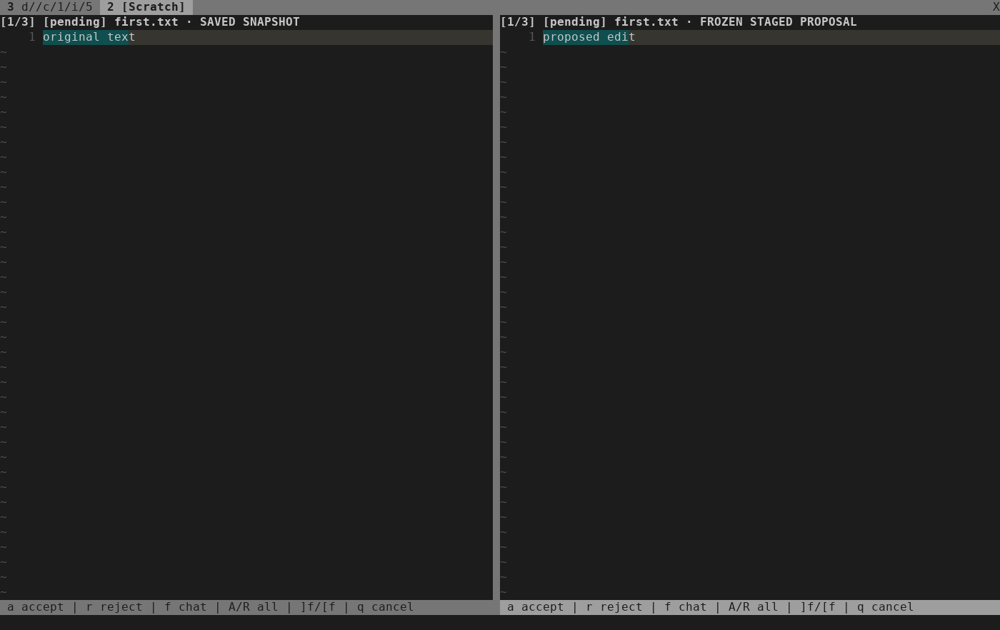

# Automatic chat review — 2026-10-03

A completed OpenCode chat proposal previously stayed in the transcript until
the user opened its picker. The chat now presents the first pending frozen file
automatically, once per proposal. A replacement revision opens its first pending
file; accepted and rejected files remain context. Discussion without a new
proposal stays in the composer.

Automatic presentation requires both owned chat windows in the current tab.
Hidden, background or repurposed chat windows defer presentation until an
explicit `:NvimAIChat` reopen. Returning with `f` preserves the draft and does not
reopen an already presented proposal. `gd` and `:NvimAIChatReview` remain available
for selecting another file or reopening a diff.

The real-key check exposed a Neovim Insert-mode hazard: changing buffers during
typing could carry insertion into a frozen preview. Automatic presentation now
waits for normal mode. The composer shows an Escape hint, keeps typed text, and
opens the diff after Escape. It never changes mode or turns typing into approval.

## Verification

- `ai_chat_auto_review` initially failed because no diff opened. It now covers
  automatic presentation, passive navigation, hidden/background/repurposed
  windows, preserved drafts, first-pending revision selection and discussion.
- Existing public-controller and approval tests now exercise automatic entry
  while retaining manual-picker, stale-dialog, source-drift and writer guards.
- Real terminal keys verify the initial diff, `f` return, manual reopening,
  partial acceptance/rejection, revised proposals and explicit batch decisions.
- At 70 columns, Ctrl-S leaves typing in the composer until Escape. No decision
  or source write occurs during typing. The automatically opened diff supports
  acceptance, rejection and file navigation. Resizing back to 140 columns keeps
  the unsent draft. Navigation sends no additional provider request.
- Narrow review bars retain `a accept`, `r reject` and `f chat`; longer controls
  truncate after those actions. Neovim's receipt-message hit-enter prompts are
  acknowledged with actual Enter keys in the narrow terminal test.

Verification commands:

```sh
python3 -I -B tests/run.py
python3 -I -B tests/run.py ai_chat ai_chat_auto_review ai_chat_approval ai_chat_controller ai_chat_view nvim_ai_chat_ui
stylua --check lua tests
git diff --check
```

The default run passed all 61 suites, including five real-key TUI cases and
relocated-install coverage. Independent review then caught two focus cases:
an ordinary tab return could arm a background proposal, and an ownership check
treated a false window result as present. Both received failing regressions
before fixes. The final six affected suites passed, including six real-key TUI
cases. The reviewer rechecked both fixes and found no remaining issues.

Formatting and whitespace checks passed. The two terminal captures were visually
inspected. Optional installed-OpenCode and live-provider checks remained skipped.

All provider traffic used the existing confined fake ACP fixture. No live
account, paid prompt or user's editor session was used.




These images were rendered from actual terminal-cell captures.
