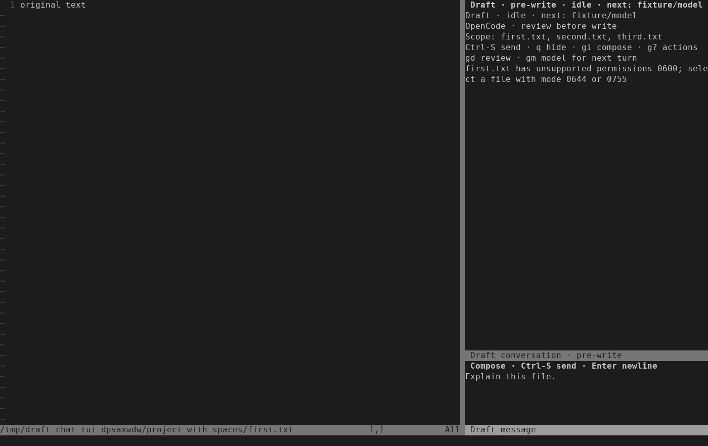

# Chat file-permission diagnosis — 2026-10-03

The first Send for a saved `tmp.txt` showed only “Request not submitted; an
explicit new retry is allowed.” Read-only metadata inspection found mode `0600`.
Calling the production source snapshot helper reproduced its refusal: the
existing guarded source contract accepts only modes `0644` and `0755`.
No credential contents were inspected and no live prompt was retried.

The shared editor capture now checks those same permission bits at chat opening
and before Send. Its refusal identifies the selected relative path, observed
mode and supported modes. Unsupported input does not launch work, erase an
unsent draft, modify source bytes or change permissions. The controller and
publication checks remain authoritative and unchanged.

## Regression evidence

The new shared-source and public-chat regressions both failed before the fix.
They cover unsupported `0600`, `0700`, `0664` and setuid `4755` files, accepted
`0644`/`0755` files, passive refusal on Open, and a permission change before Send.
The public test also confirms that an explicit Send works after the disposable
fixture's permissions are corrected.

Synthetic chat/model fixtures previously used the runner's private `0600`
default while bypassing the production controller. Their sample files now use
`0644`, like the existing production-controller fixtures. The terminal fixture
checks that the composer opened before declaring readiness. Full validation also
found an old native-mapping label expectation from the preceding onboarding
change; the expectation now matches the documented label.

Commands used for verification:

```sh
python3 -I -B tests/run.py
stylua --check lua tests
git diff --check
```

The final default run passed all 60 suites. Optional installed-OpenCode checks
remained skipped. Formatting, whitespace, local links and generated help tags
also passed.

A separate real-key terminal check changed a disposable selected file to `0600`,
typed a question and pressed Ctrl-S. The permission refusal appeared while the
conversation stayed idle, the composer retained its text, no turn or provider
request was recorded, and the source and mode stayed unchanged.



The screenshot was rendered from captured terminal cells. Raw captures and the
one-off driver are retained with local test evidence. This addresses the reported
file-admission failure; broader startup/authentication diagnostics and cold/warm
timing evidence remain in ISQ-350.
