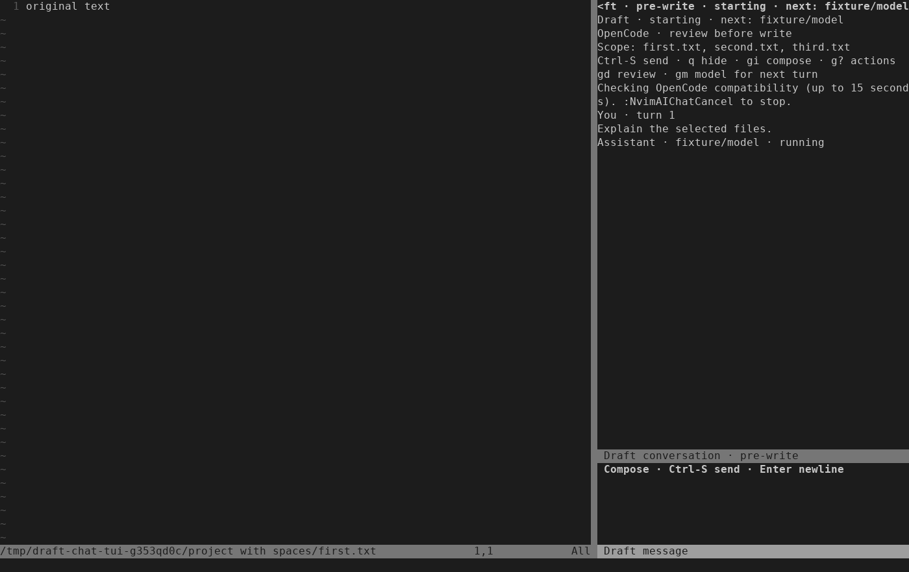
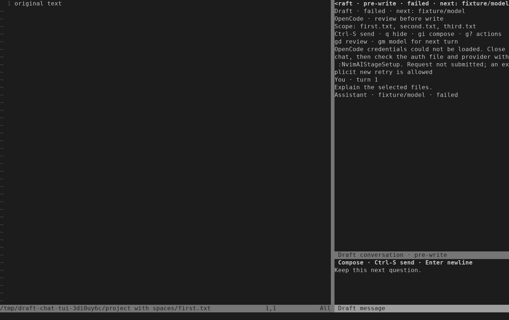

# OpenCode chat startup — 2026-10-03

The controller previously reduced missing credentials, incompatible OpenCode and
unavailable models to the same lifecycle failure. `:NvimAIStatus` followed the
saved native mode and refused while chat owned the runtime. Startup exposed no
step beyond `starting`.

The controller now emits bounded startup stages and a fixed failure category.
The owner validates the closed vocabulary and supplies actionable wording;
exception messages, credential parser input and peer error text are never used
as diagnostics. Chat, `:NvimAIStatus`, `require("draft").compact()` and
`:checkhealth draft` report the active conversation. Health labels the separate
native-companion checks explicitly. Opening chat does not validate account access
or launch work; explicit Send does.

Existing submission, shutdown, storage and token-retirement proofs still control
retry and recovery. A useful error message does not make a failed turn safe to
retry. Cancellation, file publication, deadlines and sandbox policy are unchanged.

## Regression evidence

- The initial missing-auth controller test failed because no diagnostic crossed
  the boundary. The public status test failed with `Close the conversation before
  native activity`. The owner initially rejected the new progress event.
- Production-controller tests now distinguish missing/malformed credentials,
  incompatible versions, absent model/mode options and response timeouts. Private
  path, credential and prompt sentinels do not appear in diagnostic events.
- Public chat tests reuse the confined fake ACP peer and real runtime. Missing
  credentials, incompatible versions, unavailable models, launch failure and
  startup cancellation agree across chat, status and health. Hidden failures
  remain available on reopen; unsent drafts and source files remain intact.
- The owner rejects unknown categories, extra fields and progress outside the
  permitted phase. Diagnostic text does not override recovery proofs.
- Real Neovim/tmux keys check visible progress, explicit cancellation, actionable
  credential errors and a preserved next draft. The captures below were rendered
  from actual terminal cells and visually inspected.
- The first full run exposed an asynchronous audit assertion: an already-started
  handshake could be observed while health ran. The test now checks unchanged
  turn count and no submitted prompt, allowing in-flight handshake observations.
- Independent review reproduced a stale hidden-chat statusline and a Cancel menu
  choice invalidated by startup progress. Both received failing regressions.
  Startup progress now preserves the action revision; phase changes request a
  statusline redraw, including hidden completion, initial Open and confirmed Close.
  The compact status reads the cached phase without copying the transcript.
- Direct default redraw during the headless fixture hit a reproducible Neovim
  grid-allocation crash. Default redraw now requires an attached UI; configured
  callbacks still run headlessly. Real terminal redraw was checked independently.

Verification commands:

```sh
python3 -I -B tests/run.py
python3 -I -B tests/run.py ai_chat_startup ai_conversation ai_conversation_controller ai_chat_controller nvim_ai_chat_ui
python3 -I -B tests/nvim_ai_conversation_controller.py \
  EngineTest.test_malformed_credentials_never_leak_parser_input \
  EngineTest.test_startup_timeout_is_distinct_and_never_claims_retry_safety -v
stylua --check lua tests
git diff --check
```

The final default run passed **62/62 suites**, including 35 production-controller
cases, eight real-key TUI cases and relocated-install coverage. Formatting,
whitespace and documentation-link checks passed. Independent review rechecked
both UI fixes, including actual terminal redraw; no outstanding diff findings
remain. Optional installed-runtime suites stayed skipped in the default run;
the separately measured installed-runtime baseline is described below.

The final log set is retained locally under
`.test-results/chat-startup-2026-10-03/runs/run-k96cps6r/`, alongside earlier
diagnostic runs and raw terminal captures. No user's editor session was changed.

Known lifecycle follow-up for ISQ-351: the production controller already fences
all failed owners, including failures whose semantic owner advertises safe Retry.
That older mismatch is unchanged here. If Retry is refused, use Close, correct
the displayed configuration problem and explicitly start a new conversation.
The new credential guidance already directs users through Close and setup.





## Startup measurements

Three paired measurements used baseline commit `18f9529`, before these diagnostic
changes. Each chat pair submitted two turns through the production controller
and installed OpenCode 1.18.34 to an immediate scripted loopback provider. Both
turns launched fresh workers; the second resumed the same session and retained
the first assistant reply. No real credentials or paid provider were used.

Native compatibility was measured separately, with an empty receipt cache and
then a new editor using the resulting cache. Cold runs performed 12 probes each;
cached runs performed none. This cache already existed before this change.

All values are milliseconds:

| Measurement | Sample 1 | Sample 2 | Sample 3 | Median |
| --- | ---: | ---: | ---: | ---: |
| Native compatibility, cold | 10513.4 | 10526.9 | 10463.6 | 10513.4 |
| Native compatibility, cached | 35.8 | 36.6 | 35.3 | 35.8 |
| First chat turn, command to submitted | 1711.3 | 1616.2 | 1613.3 | 1616.2 |
| Retained-session turn, command to submitted | 1718.8 | 1613.2 | 1577.2 | 1613.2 |
| First chat turn, command to settled | 2267.1 | 2184.3 | 2162.1 | 2184.3 |
| Retained-session turn, command to settled | 2310.3 | 2162.1 | 2115.1 | 2162.1 |

The first/repeated chat initialization medians were 986.6/1038.6 ms; session
creation/resume took 543.6/555.2 ms. Workspace/configuration preparation took
8.7/8.0 ms. The provider handler took 0.23/0.39 ms. These observations locate most
of the pre-submission wait in OpenCode initialization and session setup. They do
not justify changing worker lifetime, weakening validation or adding a new cache.
This change makes no latency-improvement claim.

Environment: Linux 7.0.0-34 x86_64, AMD Ryzen 9 PRO 8945HS with 16 logical CPUs,
Neovim 0.12.4, Python 3.14.4 and Bubblewrap 0.11.1. The executable was
`/home/ubuntu/.opencode/bin/opencode`, SHA-256
`9ca0b9953d49997601655e54f846a3efa464f237e47c6f1b04716d0f2e64c4c2`.

The local, ignored evidence directory
`.test-results/chat-startup-2026-10-03/benchmark/` contains the one-off `measure.py`
harness, `results/measurements.json`, `environment.json`, `verification.json` and
timestamped per-pair audits. The harness reuses the installed-runtime fixtures
from `nvim_ai_conversation_interop.py` and `nvim_ai_opencode_cache.py`, adding
timing-only wrappers around controller, turn and worker boundaries. Its exact
invocation from the repository root was:

```sh
python3 -I -B .test-results/chat-startup-2026-10-03/benchmark/measure.py \
  --samples 3 --output .test-results/chat-startup-2026-10-03/benchmark/results
```

Every pair verified one new session plus one resume, exactly two loopback provider
requests, retained context and unchanged source. All six workers and their
listeners stopped; Close removed the three retained stores and all task paths.

Limits: cold means empty disposable profiles/store/cache, not flushed OS page
cache. The observer adds some overhead. `submitted` means the prompt was written
to ACP, not accepted by a provider. Native numbers measure compatibility only,
not total companion startup. Three pairs on one machine with an immediate text
fixture do not establish live-account latency or extended daily-use acceptance.
The production sandbox remained unchanged. Cancellation, interrupted-session and
beta acceptance remain separate work packages.
