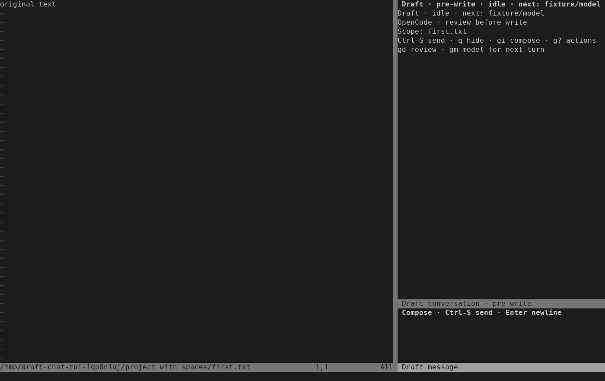

# OpenCode onboarding validation — 2026-10-03

ISQ-348 gives OpenCode chat one recommended starting path in the README and help.
The setup dialog points to chat, the chat header identifies review before write,
and the native companion picker identifies after-write review. Command routing,
saved settings and file publication behavior are unchanged.

## Checks

The focused command passed all eight suites:

```sh
python3 -I -B tests/run.py draft_setup ai_chat_view ai_chat_controller ai_chat_approval ai_runtime ai_staged nvim_ai_staged_settings nvim_ai_chat_ui
```

This includes four real-key terminal scenarios and 13 staged-settings tests.
An existing terminal assertion was updated for the intentional persistent-header
label change. The first run failed that old expectation; the final run passed.
`stylua --check lua tests` and `git diff --check` passed. README and validation
links resolve locally, and Neovim generated the new `draft-quickstart` help tag.

A separate agent-operated terminal check followed the new walkthrough using the
existing chat approval fixture, starting with staging disabled, no model and no
open conversation. It used a private HOME/XDG environment and tmux server, a
confined scripted ACP provider, and the production controller and guarded writer.

| Step | Observed result |
| --- | --- |
| Setup | Entering `fixture/model`, leaving the auth path blank and choosing Save and enable created no conversation and sent no provider request. |
| Open | `:NvimAIChat` selected the saved current file and showed review-before-write labels without sending a request. |
| Discuss | Enter inserted a newline; Ctrl-S sent the question. The reply completed with the selected file unchanged. |
| Review | A second explicit Send produced an edit. Escape, `gd`, file selection and Enter opened its frozen diff while the source stayed unchanged. |
| Approve | `a` wrote the exact proposed bytes for the selected file. The other fixture files stayed unchanged. |
| Close | Returning with `:NvimAIChat` and running `:NvimAIChatClose` closed the conversation. |
| Saved native mode | After explicitly saving native prompt mode, rerunning setup preserved it. `:NvimAIChatNew` still opened a passive pre-write conversation. |



The screenshot was rendered from the captured terminal cells at 140 columns.
The one-off driver and raw captures are retained with local test evidence.

## Limits

These checks use a fake provider and send no live model requests. They verify the
documented keyboard path and review boundary, not a real user's understanding or
everyday usability. Existing live-provider evidence remains separate. No release
or remote CI run is implied by these local checks.
