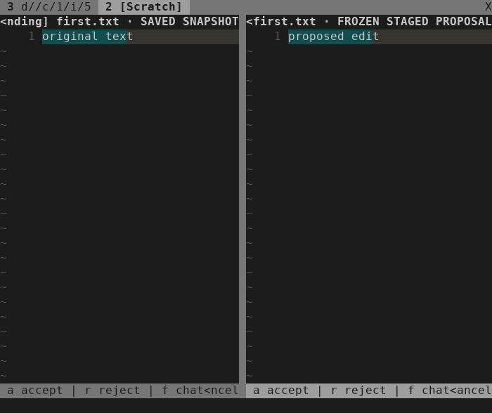

# Linux beta acceptance preparation — 2026-10-04

Scope: [ISQ-352](https://linear.app/isqrd/issue/ISQ-352/prepare-repeatable-linux-beta-acceptance).
The [reusable checklist](linux-beta-checklist.md) maps the integrated workflow to
maintained fixtures and gives exact terminal steps, expected bytes, failure
routing and a separate release-time provider scope.

Tested candidate: `3f2d67a16782e2423eaadb359d987dfbaca5a473`, with a clean tracked
tree at the start of acceptance. Runtime behavior is unchanged from
`b9cbc369fe12795b93b6d8d918607c3ef3226856`; the candidate adds an installation test
and the checklist. This results record and terminal images were added after that
checkpoint. Local passing evidence does not identify a published beta.

## Environment

Linux `7.0.0-34-generic` x86_64, Neovim `0.12.4`, LuaJIT `2.1.1774638290`, Python
`3.14.4`, Bubblewrap `0.11.1`, Git `2.53.0`, ripgrep `15.2.0` and tmux `3.7c`.
The installed OpenCode executable is `/home/ubuntu/.opencode/bin/opencode`,
version **1.18.34**, SHA-256
`9ca0b9953d49997601655e54f846a3efa464f237e47c6f1b04716d0f2e64c4c2`.

Tests used disposable HOME/XDG state and test-owned processes. The installed
checks used synthetic credentials and a loopback scripted provider. Bubblewrap,
helper trust checks, file guards and approval authority were unchanged. No
package installation, live-account prompt or user editor was involved.

## Results by evidence class

| Evidence | Result |
| --- | --- |
| Automated default fixtures | 63/63 suites passed, including 3 installation, 9 TUI and 35 controller tests. Expected installed-provider skips remain distinct from the opt-in results below. |
| Fresh relocated installation | 3/3 tests passed, including help tags and production commands from a path with spaces and unrelated cwd. |
| Core chat without tmux | Both existing production approval/recovery journeys passed with tmux absent from Neovim's PATH and no tmux environment. |
| Maintained actual-key TUI suite | 9/9 tests passed: automatic review, typing/focus guards, narrow navigation, model selection, Retry, cancellation and preserved drafts. |
| Agent-operated checklist | The documented five-turn journey passed with real terminal keys, exact bytes, two passive model choices, one session/new and four resumes. |
| Installed OpenCode artifact audit | Passed with 1.18.34; no model request. |
| Installed OpenCode with scripted provider | 4/4 production-controller interop cases and 1/1 owner-death case passed. |
| Live-account/provider acceptance | Not run. The checklist scopes four explicit prompts for a separately approved release-time run. |
| User-operated acceptance | Not run. Agent automation is not a substitute for a user's installation and daily-use experience. |
| Hosted CI on this candidate | Not run; Release 1 owns the final candidate CI gate. |

## Installation and no-tmux proof

The new `test_relocated_core_chat_without_tmux` extends `nvim_ai_install` rather
than introducing another harness. It copies the checkout into a plugin directory
with spaces, starts clean Neovim from an unrelated directory, and supplies a
private PATH containing only the required core executables. Neovim must report
`executable("tmux") == 0`; `TMUX` and `TMUX_PANE` must be absent.

That editor runs `ai_chat_approval` and `ai_chat_recovery` without substituting the
controller or writer. These cover discussion, model selection, partial approval
and rejection, revision, continued context, source conflicts, dirty buffers,
safe/unsafe Retry, Cancel/Close preservation and fresh New. The environment
assertion first failed with the ordinary PATH in `run-7_biwzfl`; after isolation,
all three install tests passed in `run-zg38d_n6`. This was an expected test setup
failure, not a product defect.

This proves a fresh runtime-path installation and the no-tmux core boundary. It
does not revalidate lazy.nvim or the user's personal Neovim configuration. The
earlier [normal-configuration check](2026-09-26-normal-config.md) remains separate
historical evidence.

## Terminal walkthrough

The one-off driver reused the maintained `ChatApprovalUITest` harness and the
exact prompts from the checklist. It began with passive opening and discussion,
changed the next model without sending, hid/reopened the draft and explicitly
requested a proposal. Insert mode retained focus until Escape opened the diff.

Accepting first, rejecting second and discussing the pending proposal left disk
bytes at `proposed edit\n`, `original text\n`, `original text\n`. Revising pending
third showed `revised edit` without changing its source. File navigation and
explicit approval produced `proposed edit\n`, `original text\n`,
`revised edit\n`. A final discussion preserved both historical model labels.
Close followed by New retained saved files, cleared context and sent nothing.

The maintained TUI suite also passed at 70 columns × 28 rows. The unsent composer
draft survived insert-mode deferral, acceptance, rejection and return to chat.
Primary `a`/`r` hints remain visible; secondary footer hints truncate at this
width. This is a nonblocking layout observation for UX 2, not a failed action;
the checklist supplies the navigation/batch keys.

These PNGs were rendered from actual captured terminal cells with the existing
renderer and visually inspected. They are not proposed UI mockups.

## Reproduction and evidence

The final default gate uses `python3 -I -B tests/run.py`. The installed artifact
audit uses `tests/run.py --opencode /home/ubuntu/.opencode/bin/opencode
ai_opencode_managed`. The separate installed runs follow the private-environment
recipe in [tests/README.md](../../tests/README.md#installed-opencode-audit-optional):

- `tests/nvim_ai_conversation_interop.py -v`;
- `tests/nvim_ai_conversation_lifetime.py LifetimeTest.test_real_opencode_owner_death_stops_active_listener_without_resuming -v`.

Terminal captures use
`DRAFT_CHAT_CAPTURE_DIR=/absolute/evidence/path python3 -I -B tests/nvim_ai_chat_ui.py -v`.
The test constructs its own private editor/tmux environment. The checklist
provides a separate direct-terminal launcher for a person's run.

Local evidence is archived under `.test-results/linux-beta-2026-10-04/`:
the baseline/red/green installation logs, final default run `run-60v09_29`,
installed audit `run-94z_po18`,
`beta-environment.json`, `beta-tui.log`, `beta-checklist.log`, the one-off driver,
raw captures, `beta-interop.log` and `beta-lifetime.log`.
The two one-off drivers derive the checkout root from their original location:
to replay an archived driver, copy it directly into the candidate checkout's
`.test-results/` directory first. The archive's replay notes preserve the exact
commands and installed executable path; the maintained checklist does not depend
on these local drivers.

The complete gate passed **63/63 suites, 0 failures**. `stylua --check lua tests`
and `git diff --check` passed, and local document/image links across the changed
documentation resolved. Independent review found no correctness or
safety issues. Its only minor observation concerned moving the one-off drivers;
the original-location replay instructions above address that concern without
changing the already-executed evidence scripts.

## Handoff to Release 1

No production failure was reproduced by the added no-tmux gate or the terminal
journey. Future failures have owning packages in the reusable checklist; the
narrow-footer observation belongs to UX 2 (ISQ-349). No Linear issue was changed
by this local evidence work.

[Release 1 — ISQ-353](https://linear.app/isqrd/issue/ISQ-353/prepare-the-linux-beta-candidate-and-release-handoff)
still needs final-candidate hosted CI, version/installation/upgrade/rollback
notes, a scoped current-version live-provider decision and user acceptance.
Earlier live-provider proof on OpenCode 1.18.30 does not establish live-provider
acceptance on 1.18.34. The proposed four-prompt run must name the provider/model,
auth path, disposable files, request/cost limit and operator before authorization.
Publishing or tagging a release remains a separate decision.

Existing limits remain fixed file scope, no new-file creation, no automatic
transcript/crash restoration, retained interruption artifacts and non-atomic
multi-file publication. See the [recovery record](2026-10-03-chat-recovery.md).
